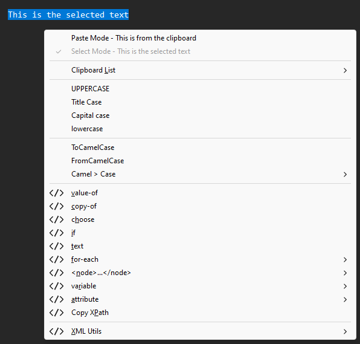
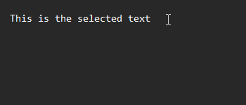

# Clipboard Utilities
## Context Menu
### Hot Keys
- `Alt` + `Shift` + `Space`  
Opens full context menu

## Clipboard Manager
### Hot Keys
- `Alt` + `Shift` + `V`  
Opens clipboard context menu 

 From this menu, various actions can be performed like:
  - Changing to a different clip manager list.
  - Bulk pasting the current clip manager list in different modes. For description of supported bulk pasting formats, see [Bulk Copy/Paste Formats](#bulk-copypaste-formats).
  - Clearing the current clip manager list, all clip manager lists, or all but the default clip manager lists.
  - Selecting and pasting a specific clip of the current clip manager list.

- `Ctrl` + `Shift` + `X`  
Swaps content selected with content currently in clipboard. This pastes the contents of the clipboard while simultaneously copying the replaced contents to the clipboard.

- `Ctrl` + `Shift` + `C`  
Clears clips from clip manager and copies selected content to it. If content is a supported delimited string, then it is parsed with each value stored as a separate clip item.

#### Bulk Copy/Paste Formats
| Format (Ordered by Priority) | Description
|------------------------------|----------
| CSV                          | 2D data formatted as comma seperated values. Commonly used as the format of `.csv` files.
| TSV                          | 2D data formatted as tab seperated values. Commonly used by copying/pasting from spreadsheets.
| Comma List                   | A single line of text is stored as multiple clips seperated by its commas.
| List                         | Each line of text is stored as a seperate clip.

- `Ctrl` + `Shift` + `V`  
Activates clip manager tooltip and (while held) enables the following clip manager key actions:

| Key                    | Action
|------------------------|----------
| - `V`                  | Releasing `V` disables further actions.  **Note:** If released within a certain period of time without performing any other action, then the native `Ctrl` + `Shift` + `V` command is triggered.
| `Up` / `Scroll Up`     | Selects the previous clip in the clip manager list.
| `Down` / `Scroll Down` | Selects the next clip in the clip manager list.
| `Enter` / `Left Click` | Pastes the currently selected clip.
| `Delete`               | Deletes the currently selected clip and selects the next clip.  If there is no next clip, then the previous clip is selected instead.
| `Backspace`            | Deletes the previous clip in the clip manager list.
| `Left` / `Back`        | If selected clip is unchanged, then this selects and pastes the previous clip in the clip manager list.  If the selected clip has changed, then this instead functions like `Delete`.
| `Right` / `Forward`    | If selected clip is unchanged, then this selects and pastes the next clip in the clip manager list.  If the selected clip has changed, then this instead functions like `Enter` / `Left Click`.
| `0...9`                | Select a different clip manager list. `0` is the default clip manager list with additional ones selectable with `1...9`.  Switching to one that does not exist and copying anything to the clipboard will create a new clip manager list.
| `L`                    | Bulk paste the contents of the current clip manager list with each clip starting on a new line.
| `,`                    | Bulk paste the contents of the current clip manager list comma-seperated.

## Text Transformations
### Case Transformations
| Case State   | _Text conTent_
|--------------|-----------------
| UPPERCASE    | _TEXT CONTENT_
| Title Case   | _Text Content_
| Capital case | _Text content_
| lowercase    | _text content_
| CamelCase    | _TextContent_

### Hot Keys
- `Ctrl` + `Shift` + `Scroll Up`  
`Ctrl` + `Shift` + `Scroll Down`  
Takes selected text and shifts it to the next higher case state. The currently selected case state is shown in the form of a tooltip.
  - `Enter` causes the currently selected case state to be applied to the selected text. If currently selected case state is unchanged for a small period of time, then it get auto-applied. 

  - `Esc` cancels the transformation and prevents it from being auto-applied. 

- `Ctrl` + `Shift` + `Scroll Tilt Right`  
`Ctrl` + `Shift` + `Scroll Tilt Left`  
Takes selected text and transforms it to/from camel case.

- `Alt` + `"` `'` `(` `)` `{` `}` `[` `]`  
Wrap selected text based on which supported wrapper key is pressed

| Key       | _Text Content_
|:---------:|-----------------
| `"`       | "_Text Content_"
| `'`       | '_Text Content_'
| `(` / `)` | (_Text Content_)
| `{` / `}` | {_Text Content_}
| `[` / `]` | [_Text Content_]

If a closing wrapper key `)` `}` `]` is pressed, then a named wrapping is attempted specifically for the triggered wrapper.

If the clipboard contains content wrapped by the triggered wrapper that is blank (or comma seperated with the first value blank), then the selected text is inserted in replacing that blank value.

| Example     | "_Text Content_"
|-------------|-----------------
| name()      | name("_Text Content_")
| name[]      | name["_Text Content_"]
| name(, ...) | name("_Text Content_", ...)

If a named wrapping fails, then it falls back to the standard wrapping.

## XML Transformations
### Hot Keys
- `Alt` + `Shift` + `<`  
Escapes `<` and `>` to `&lt;` and `&gt;` respectively in the selected text.

- `Alt` + `Shift` + `>`  
Unescapes `&lt;` and `&gt;` to `<` and `>` respectively in the selected text.

- `Alt` + `Shift` + `E`  
Escapes `<` `>` `'` `"` `&` to `&lt;` `&gt;` `&apos;` `&quot;` `&amp;` respectively in the selected text.

- `Alt` + `Shift` + `D`  
Unescapes `&lt;` `&gt;` `&apos;` `&quot;` `&amp;` to `<` `>` `'` `"` `&` respectively in the selected text.

- `Alt` + `Shift` + `Delete`  
Wraps selected text in XML comment `<!-- Text Content -->`.

- `Alt` + `Shift` + `Insert`  
Unwraps first found XML comment in the selected text.

## Configurations
Various configurations are available and are stored in an auto-generated file `_data\_configs.json`.

The configuration window can be opened by double-clicking the tray icon.

